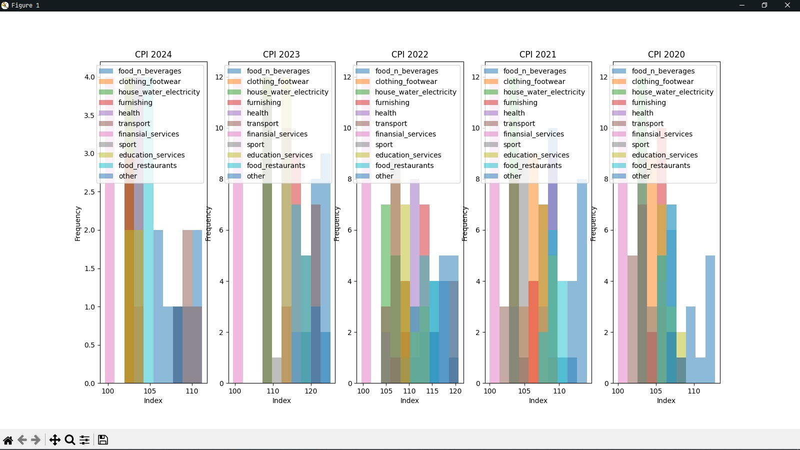

## Before Running
```bash
$ pip install -r requirements.txt
# If not working you can running this command

$ python -m pip install requirements.txt

# or can use this command
$ py -m pip install requirements.txt
```

## Command Line
**_to showing help command_**
```
$ python main.py help
+----------+-----------------------------------------------------------------+
| flag     | description                                                     |
+==========+=================================================================+
| help     | print help command                                              |
+----------+-----------------------------------------------------------------+
| show     | showing about info dataframe or graph [inflation / cpi / graph] |
+----------+-----------------------------------------------------------------+
| generate | generated preparation data or mean data                         |
+----------+-----------------------------------------------------------------+
```

**_to print `show help` command_**
```
$ python main.py show help

+-----------------+------------------------------+-------------------------------------------------------------------------------------+
| flag            | description                  | example usage                                                                       |
+=================+==============================+=====================================================================================+
| inflation       | show about info or dataframe | ex. python main.py show inflation [ info / dataframe ]                              |
+-----------------+------------------------------+-------------------------------------------------------------------------------------+
| cpi             | show about info or dataframe | ex. python main.py show cpi [ info / dataframe ]                                    |
+-----------------+------------------------------+-------------------------------------------------------------------------------------+
| graph inflation | show graph inflation         | ex. python main.py show graph inflation [ 2020 / 2021 / 2022 / 2023 / 2024 / mean ] |
+-----------------+------------------------------+-------------------------------------------------------------------------------------+
| graph cpi       | show graph cpi               | ex. python main.py show graph cpi [ 2020 / 2021 / 2022 / 2023 / 2024 ]              |
+-----------------+------------------------------+-------------------------------------------------------------------------------------+
```

**_to print `generate help` command_**
```
$ python main.py generate help

+-----------+--------------------------------------+---------------------------------------------------------------+
| flag      | description                          | example usage                                                 |
+===========+======================================+===============================================================+
| inflation | generated data preparation inflation | ex. python main.py generated inflation [ preparation / mean ] |
+-----------+--------------------------------------+---------------------------------------------------------------+
| cpi       | generated data preparation cpi       | ex. python main.py generated inflation [ preparation ]        |
+-----------+--------------------------------------+---------------------------------------------------------------+
```
