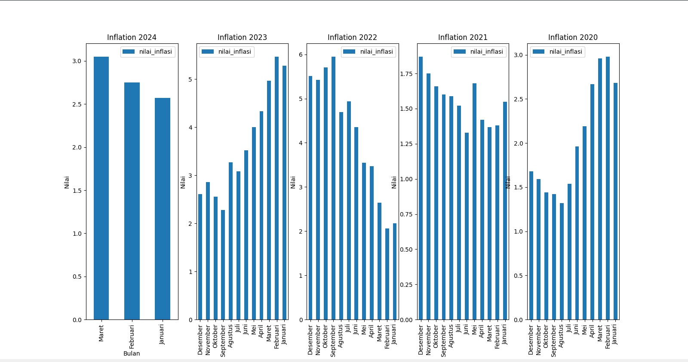

## Before Running
```bash
$ pip install -r requirements.txt
# If not working you can running this command

$ python -m pip install requirements.txt

# or can use this command
$ py -m pip install requrements.txt
```

## Command Line
**_Show Info about Data Structure_**
```bash
$ python main.py show_info
```

**_Show all Raw Data_**
```bash
$ python main.py show_dataframe
```

**_Generate data preparation_**
```bash
$ python main.py generate_data_preparation
```

**_Generate data accumulation per-year_**
```bash
$ python main.py generate_accumulation
```

**_Show graph for Inflation 2024_**
```bash
$ python main.py graph_2024
```

**_Show graph for Inflation 2023_**
```bash
$ python main.py graph_2023
```

**_Show graph for Inflation 2024_**
```bash
$ python main.py graph_2022
```
